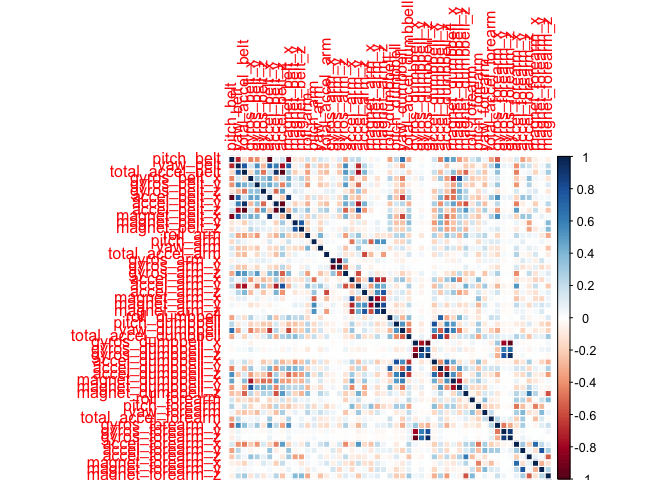
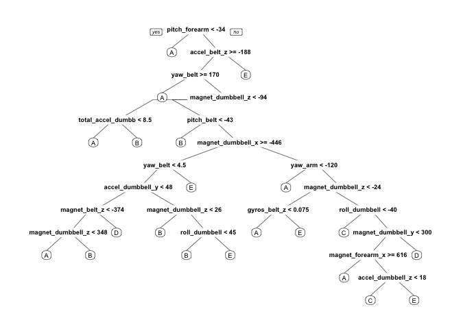
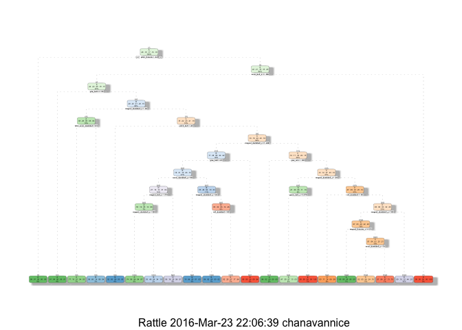

# Practical Machine Learning - Course Project
Chana VanNice  
March 21, 2016  

# Executive Summary 
This report is prepared for the Coursera Practical Machine Learning assignment. The report will use data from the [Weight Lifting Exercise Dataset](http://groupware.les.inf.puc-rio.br/har). The data consists of personal activity collected from devices such as Jawbone Up, Nike FuelBand, and Fitbit.  These type of devices assist participants to easily quantify how much of a particular activity they do, but they rarely quantify how well they do it. This project will use data from accelerometers on the belt, forearm, arm, and dumbell of 6 participants to predict the manner in which the participants did the exercise. This is the **"classe"** variable in the training set.
 
Instructions were to create a report that describes the following: 
<ol>
<li>How you built your model</li> 
<li>How you used cross validation</li> 
<li>What you think the expected out of sample error is</li> 
<li>Why you made the choices you did</li> 
</ol>
 
## Preprocessing 
Load data 

```r
library(knitr)
opts_chunk$set(echo = TRUE, results = 'hold')
library(dplyr)
library(data.table)
library(corrplot)
library(caret)
library(randomForest)
library(rpart)
library(rpart.plot)
library(rattle)

## Download and unpack data files
trainingUrl <-"https://d396qusza40orc.cloudfront.net/predmachlearn/pml-training.csv"
testingUrl <- "https://d396qusza40orc.cloudfront.net/predmachlearn/pml-testing.csv"
trainRaw <- "./data/pml-training.csv"
testRaw  <- "./data/pml-testing.csv"
if (!file.exists("./data")) {
     dir.create("./data")
}
if (!file.exists(trainRaw)) {
     download.file(trainingUrl, destfile=trainRaw, method="curl")
}
if (!file.exists(testRaw)) {
     download.file(testingUrl, destfile=testRaw, method="curl")
}

 # read in the data treating empty values as NA
trainData <- read.csv("data/pml-training.csv", sep = ",", na.strings = c("", "NA"))
testData<- read.csv("data/pml-testing.csv", sep = ",", na.strings = c("", "NA"))

dim(trainData)
```

```
## [1] 19622   160
```

```r
dim(testData)
```

```
## [1]  20 160
```

The training data contains 19622 observations and 160 variables. The testing data contains 20 oberservations and 160 variables. The "classe" variable (outcome) is the manner in which participants did the exercise. 
 
## Data Preparation 
 
Many columns have missing values and variables that will not provide much power for prediction. Remove near zero covariates. 

```r
# Remove near zero covariates for training data, if any
nzVars <- nearZeroVar(trainData, saveMetrics = T)
trainData_nzv <- trainData[, !nzVars$nzv]
if (any(trainData_nzv$nzv)) nzv else message("No variables with near zero variance")
```

```
## No variables with near zero variance
```

```r
# Remove near zero covariates for testing data, if any
nzVars_test <- nearZeroVar(testData, saveMetrics = T)
testData_nvz <- testData[, !nzVars_test$nzv]
```
 
Remove variables with more than 80% missing values as they will not assist with power in the prediction. 

```r
# remove variables with more than 80% missing values for training data
nav <- sapply(colnames(trainData_nzv), function(x) if(sum(is.na(trainData_nzv[, x])) > 0.8 * nrow(trainData_nzv)) {return(T)} else {return(F)})

# Keep variables that less than 20% missing values
trainData_nav <- trainData_nzv[, !nav]

# Remove variables with more than 80% missing values for testing data
nav <- sapply(colnames(testData_nvz), function(x) if(sum(is.na(testData_nvz[, x])) > 0.8 * nrow(testData_nvz)) {return(T)} else {return(F)})

# Keep variables that less than 20% missing values
testData_nav <- testData_nvz[, !nav]
```
 
Remove columns that do not contain sensor information. Keep sensor related columns that have values for both training and testing datasets. 

```r
# Remove first 7 columns as they are not relevant
classe <- trainData_nav$classe
trainData_reduced <- trainData_nav %>% select(-(1:7))
trainClean <- trainData_reduced[, sapply(trainData_reduced, is.numeric)]
trainClean$classe <- classe

testData_reduced <- testData_nav %>% select(-(1:7))
testClean <- testData_reduced[, sapply(testData_reduced, is.numeric)]

dim(trainClean)
dim(testClean)
```

```
## [1] 19622    52
## [1] 20 52
```
 
The features have been reduced to 52 variables for both the training and testing datasets. 

Evaluate the data again 

```r
str(trainClean)
```


```r
# confirm valid values in the outcome "classe"
unique(trainClean$classe)
```

```
## [1] A B C D E
## Levels: A B C D E
```
 
## Build and Train Model 
Split the training data into training and testing sets for cross validation. 

```r
set.seed(12345)
inTrain <- createDataPartition(y = trainClean$classe, p = 0.6, list = FALSE)
trainSet <- trainClean[inTrain,]
testSet <- trainClean[-inTrain,]

dim(trainSet) # training set
dim(testSet) # validation set
```

```
## [1] 11776    52
## [1] 7846   52
```
 
There are *11776* samples and *52* variables for training. For testing, there are *11776* samples and *52* variables. 

Due to its high accuaracy rate, I chose to train the model using the *Random Forest* method. The model is built over 52 variables. Cross validation is used for the *train control* method. 

```r
set.seed(12345)
control_rf <- trainControl(method = "cv", number = 3, verboseIter = FALSE)
mod_rf <- train(trainSet$classe ~ ., data = trainSet, 
                method = "rf", trControl = control_rf)

mod_rf$finalModel
```

```
## 
## Call:
##  randomForest(x = x, y = y, mtry = param$mtry) 
##                Type of random forest: classification
##                      Number of trees: 500
## No. of variables tried at each split: 26
## 
##         OOB estimate of  error rate: 0.85%
## Confusion matrix:
##      A    B    C    D    E class.error
## A 3340    6    1    0    1 0.002389486
## B   22 2246   11    0    0 0.014480035
## C    0    8 2036    9    1 0.008763389
## D    0    0   25 1901    4 0.015025907
## E    0    0    3    9 2153 0.005542725
```
 
The *Random Forest* model used 500 trees and tried 26 variables at each split. The **OOB estimate of error rate** is 0.85%. 
 
Use the fitted model to predict the **"classe"** in the *testSet* and display the confusion matrix to compare the predicted versus the actual. 
 
Estimate the model performance on the validation set (*testSet*). 

```r
# prediction for training set
predict_rf <- predict(mod_rf, newdata = testSet)
confusionMatrix(testSet$classe, predict_rf)

mean(predict(mod_rf, testSet) == testSet$classe) * 100
```

```
## Confusion Matrix and Statistics
## 
##           Reference
## Prediction    A    B    C    D    E
##          A 2229    3    0    0    0
##          B   12 1499    5    0    2
##          C    0    5 1360    3    0
##          D    0    0   18 1266    2
##          E    0    0    2    6 1434
## 
## Overall Statistics
##                                           
##                Accuracy : 0.9926          
##                  95% CI : (0.9905, 0.9944)
##     No Information Rate : 0.2856          
##     P-Value [Acc > NIR] : < 2.2e-16       
##                                           
##                   Kappa : 0.9906          
##  Mcnemar's Test P-Value : NA              
## 
## Statistics by Class:
## 
##                      Class: A Class: B Class: C Class: D Class: E
## Sensitivity            0.9946   0.9947   0.9819   0.9929   0.9972
## Specificity            0.9995   0.9970   0.9988   0.9970   0.9988
## Pos Pred Value         0.9987   0.9875   0.9942   0.9844   0.9945
## Neg Pred Value         0.9979   0.9987   0.9961   0.9986   0.9994
## Prevalence             0.2856   0.1921   0.1765   0.1625   0.1833
## Detection Rate         0.2841   0.1911   0.1733   0.1614   0.1828
## Detection Prevalence   0.2845   0.1935   0.1744   0.1639   0.1838
## Balanced Accuracy      0.9971   0.9958   0.9904   0.9949   0.9980
## [1] 99.27352
```
The model shows a **99.3%**  accuracy on the cross validation set. 
 
# Results
Apply the model to the **testing** dataset. The **testing** dataset consist 20 observations and 52 variables. 

Predictions on real test set 

```r
predictFinal <- predict(mod_rf, testClean)
predictFinal
```

```
##  [1] B A B A A E D B A A B C B A E E A B B B
## Levels: A B C D E
```
 
Results submitted to the course quiz indicate 100% accuracy rate. 
 
# Appendix: Figures
Fig. 1 Correlation Matrix

```r
corPlot <- cor(trainSet[, -length(names(trainSet))])
corrplot(corPlot, method = "color")
```

 
 
Fig. 2 

```r
tree <- rpart(trainSet$classe ~ ., data = trainSet, method = "class")
rpart.plot(tree)
```

 
 
Fig. 3 

```r
set.seed(12345)
fancyRpartPlot(tree)
```

 
